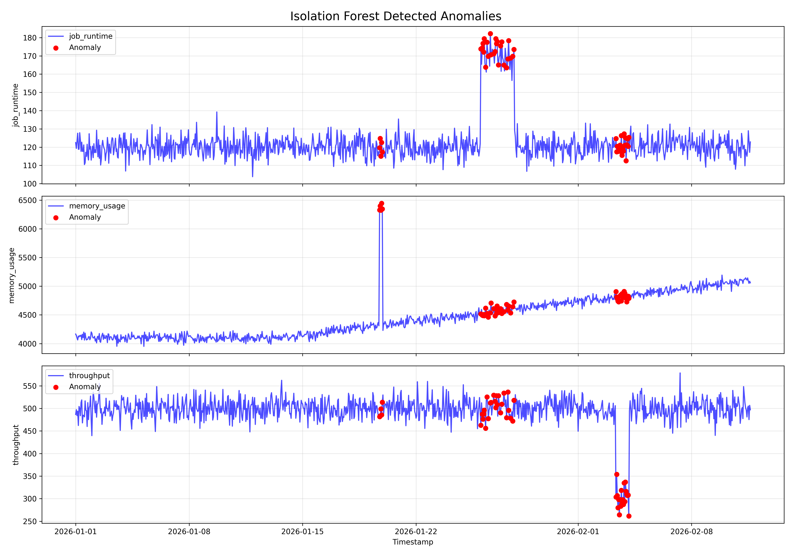

# Monitoring Anomaly Lab

This project explores automated performance monitoring and anomaly detection for large-scale scientific software pipelines. As models and simulation codebases grow, detecting regressions, memory leaks, and throughput drops is critical to prevent resource waste and silent failures.

## Features
- **Baseline Modeling**: Implements a rolling statistical baseline (EWMA / rolling mean & std) to detect temporal deviations.
- **Regression Detection**: Highlights sudden anomalous deviations using statistical bounds (Z-score) and machine learning multivariant anomaly detection (Isolation Forest).

## Project Overview
This repository contains a modular Python structure that generates synthetic performance metrics, processes them to establish statistical baselines, and flags anomalous deviations:
- `data_generator.py` - Synthesizes time-series data with noise, long-term drift (like memory leaks), and sudden performance regressions.
- `anomaly_detector.py` - Provides modular, composable detection algorithms.
- `visualize.py` - Exposes visualization helpers to map the flagged points back onto the metrics timeline.

## Running the Pipeline
```bash
# 1. Install dependencies
pip install -r requirements.txt

# 2. Synthesize baseline telemetry data
cd monitoring-anomaly-lab
python data_generator.py

# 3. Apply baseline detection algorithms
python anomaly_detector.py

# 4. Save and inspect highlighted anomalies
python visualize.py
```

## Results

After running the pipeline, the visualization script outputs an `iforest_anomalies.png` plot showing where global regressions, memory leaks, and throughput drops occurred:


